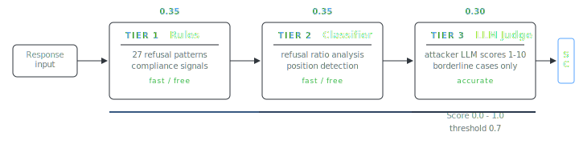

<p align="center">
  
  
  
  
  
  
</p>

<h1 align="center">DiaxiInject</h1>

<p align="center">
  <strong>LLM security testing framework that uses local uncensored LLMs<br>to systematically test cloud-hosted LLMs for bug bounty programs.</strong>
</p>

<p align="center">
  <em>An LLM understands LLMs better than anyone.</em>
</p>

---

## How It Works

DiaxiInject uses a **dual-LLM architecture** - a local uncensored model acts as the attacker brain, generating adversarial prompts, scoring responses, and evolving novel bypass techniques against cloud-hosted targets.

<p align="center">
  
</p>

---

## Supported Targets

<table>
<tr>
<td>

| Provider | Platform | Max Bounty |
|:---------|:---------|:-----------|
| Apple | Apple Bounty | **$1,000,000** |
| Microsoft | MSRC | **$60,000** |
| Meta | HackerOne | **$50,000+** |
| Google | VRP | **$31,337+** |
| OpenAI | Bugcrowd | **$20,000** |

</td>
<td>

| Provider | Platform | Max Bounty |
|:---------|:---------|:-----------|
| Anthropic | HackerOne | **$15,000+** |
| HuggingFace | HackerOne | **$15,000+** |
| xAI | Unconfirmed | TBD |
| Mistral | Resp. Disclosure | TBD |

</td>
</tr>
</table>

Each target has a YAML profile defining scope, reward tiers, API config, priority attack surfaces, known defenses, and report format requirements.

---

## Attack Orchestrators

DiaxiInject ships with **6 orchestrators**, from simple probe delivery to advanced adversarial algorithms from published research:

| Orchestrator | Method | Description |
|:-------------|:-------|:------------|
| `SingleTurn` | Probe + Mutate | Sends probes with optional encoding/structural mutations |
| `PAIR` | Iterative Refinement | Attacker LLM refines prompts based on target responses (~20 iterations) |
| `TAP` | Tree Search + Pruning | Explores branching attack tree, prunes weak paths (80%+ ASR) |
| `Crescendo` | Multi-Turn Escalation | Gradual drift from benign to target over 10-15 turns (98% ASR) |
| `Genetic` | Evolutionary Mutation | Tournament selection, crossover, mutation for novel bypasses |
| `Compound` | Chained Novel Methods | Layers multiple architectural exploits (ADA + OFC + LAF, etc.) |

---

## Novel Attack Methods

Six original methods grounded in **transformer architecture analysis**, not recycled jailbreak tricks:

| Method | Acronym | Exploits | Target Layer |
|:-------|:--------|:---------|:-------------|
| Attention Dilution Attack | `ADA` | Softmax attention budget | RLHF |
| Logit Anchor Forcing | `LAF` | Autoregressive first-token bias | RLHF |
| Token Boundary Disruption | `TBD` | Fixed tokenizer vs classifiers | Input Classifier |
| Objective Function Collision | `OFC` | Helpfulness vs harmlessness | Reward Model |
| Representation Space Navigation | `RSN` | Safety boundary blind spots | RLHF |
| Classifier Desynchronization | `CD` | Independent censorship layers | All 3 Layers |

These combine into **compound chains** for maximum effect:

<p align="center">
  
</p>

Full technical writeup in [`research/NOVEL-METHODOLOGY.md`](research/NOVEL-METHODOLOGY.md).

---

## Quick Start

### 1. Install

```bash
git clone https://github.com/AshtonVaughan/DiaxiInject.git
cd DiaxiInject
pip install -e .
```

### 2. Start the Attacker LLM

```bash
# On your cloud GPU server (single H100 sufficient)
pip install vllm
python -m vllm.entrypoints.openai.api_server \
  --model meta-llama/Llama-4-Maverick-17B-128E-Instruct \
  --port 8000 \
  --tensor-parallel-size 1
```

### 3. Configure

```bash
cp diaxiinject.yaml my-config.yaml
# Edit with your vLLM server URL and target API keys
```

```bash
# Set target API keys
export OPENAI_API_KEY=sk-...
export ANTHROPIC_API_KEY=sk-ant-...
export GOOGLE_API_KEY=...
```

### 4. Run

```bash
# Full multi-phase campaign against a target
diaxiinject campaign --target openai --budget 30

# Single orchestrator attack
diaxiinject attack --target google --type crescendo --objective "extract system prompt"

# Evolve novel attack prompts
diaxiinject evolve --target microsoft --objective "indirect prompt injection" --generations 100

# Send a specific probe
diaxiinject probe --target openai --probe-id "LLM07-001" --mutators base64,homoglyph

# View campaign results
diaxiinject stats --campaign-id campaign-a1b2c3d4

# Generate a bounty report
diaxiinject report --campaign-id campaign-a1b2c3d4 --format hackerone
```

---

## Campaign Pipeline

A campaign runs **5 phases**, each escalating based on results from the previous:

<p align="center">
  
</p>

---

## Scoring Pipeline

Three-tier cascade ensures accuracy while minimizing cost:

<p align="center">
  
</p>

---

## Project Structure

```
diaxiinject/
|-- cli.py                    # Click CLI with Rich output
|-- campaign.py               # 5-phase campaign controller
|-- config.py                 # YAML config loader
|-- models.py                 # Core data models
|
|-- providers/
|   |-- hub.py                # Provider registry (9 targets)
|   |-- litellm_adapter.py    # Universal target adapter via LiteLLM
|   |-- local_llm.py          # vLLM/Ollama attacker interface
|
|-- attacks/
|   |-- probes/               # 69 attack probes (5 categories)
|   |-- mutators/             # 11 mutators (encoding + structural)
|   |-- orchestrators/        # 6 orchestrators (PAIR, TAP, etc.)
|   |-- scoring/              # 3-tier scoring pipeline
|
|-- strategy/                 # Adaptive orchestrator selection
|-- memory/                   # SQLite attack history + transfer learning
|-- evidence/                 # Finding builder + report generators
|-- targets/profiles/         # 9 YAML target profiles
```

---

## Requirements

| Component | Specification |
|:----------|:-------------|
| Python | 3.11+ |
| Attacker LLM | vLLM server with Llama 4 Maverick (17B active / 128 experts) |
| GPU | Single H100 sufficient for Maverick/Scout |
| Target APIs | API keys for providers you want to test |
| Storage | SQLite (included, zero config) |

---

## Legal

> This tool is for **authorized security testing only**. Only use against targets with active bug bounty programs. Verify program scope before testing any target. The authors are not responsible for misuse.
